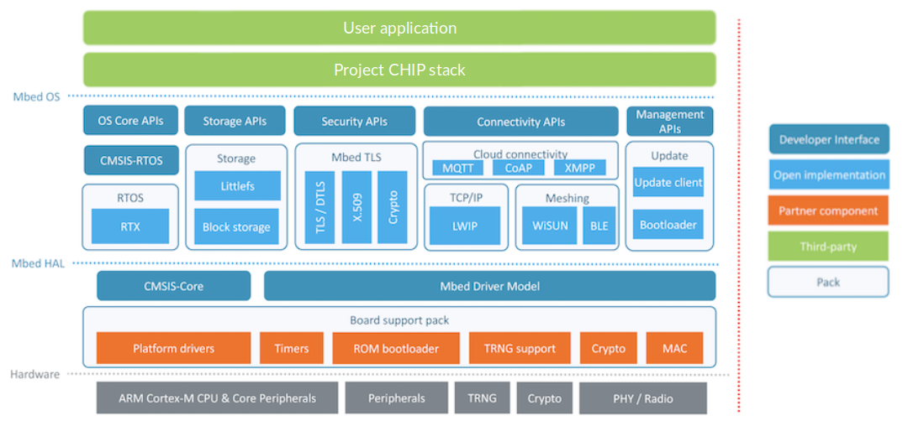

  

# Mbed-OS platform overview

The Mbed-OS platform is a
[CHIP](https://github.com/project-chip/connectedhomeip) platform that uses
ARM Mbed-OS 6.

The following diagram shows a simplified structure of a CHIP application which runs on
the top of the Mbed-OS.

    

# ARM Mbed-OS

ARM Mbed OS is an open source embedded operating system designed specifically for the 
"things" in the Internet of Things. It includes all the features you need to develop
a connected product based on an Arm Cortex-M microcontroller, including security, 
connectivity, an RTOS and drivers for sensors and I/O devices.

Mbed OS provides an abstraction layer for the microcontrollers it runs on,
so that developers can focus on writing C/C++ applications that call functionality
available on a range of hardware. That means Mbed OS applications can be reused on any
Mbed-compatible platform.

Mbed OS uses a hardware abstraction layer (HAL) to support the most common parts of a
microcontroller, such as timers. This foundation facilitates writing applications
against a common set of application programming interfaces (APIs); device automatically
includes necessary libraries and driver support for standard MCU peripherals, such as I2C,
serial and SPI.

Mbed OS has an RTOS core, so it supports deterministic, multithreaded, real-time software
execution. The RTOS primitives are always available, allowing drivers and applications
to rely on threads, semaphores, mutexes and other RTOS features.

The structure of Mbed OS enables matching applications and storage systems. In other words,
where the block level storage options vary and are application dependent, The file system
that best fits the IoT device can be chosen. The FAT file system - backed by an SD card - provides
compatibility with other operating systems, such as Windows, Mac OS or Linux. When high
reliability and recovery from power failure are important, it makes sense to use our
embedded file system, backed with a (Q)SPI NOR flash chip.

Finally, Mbed OS implements the retargeting layer and boot process integration of each
supported toolchain, so application development feels similar to C or C++ development
for any other operating system.

# CHIP example applications
The ARM Mbed-OS platform provides bunch of ported CHIP sample applications which can be used
to spped-up developemnt process:
- shell
- all-clusters-app
- [lock-app](../../examples/lock-app/mbed/README.md)
- [lighting-app](../../examples/lighting-app/mbed/README.md)

## CHIP stack configuration
In each of supported examples, the CHIP stack can be configured by modyfying `CHIPProjectConfig.h` file
which is placed inside the project directory.

## Mbed-OS configuration
The Mbed-OS gives possibility to tweak its parameters by using
[Mbed-OS configuration system](https://os.mbed.com/docs/mbed-os/v6.12/program-setup/advanced-configuration.html).
The same configuration system can be used to change default hardware target setup used in
application. Additionally, it is the first place for adding support of the new hardware
target support into the application. Mbed-OS configuration system can be accessed by modyfing
`mbed_app.json` file which exists in each sample project directory.
